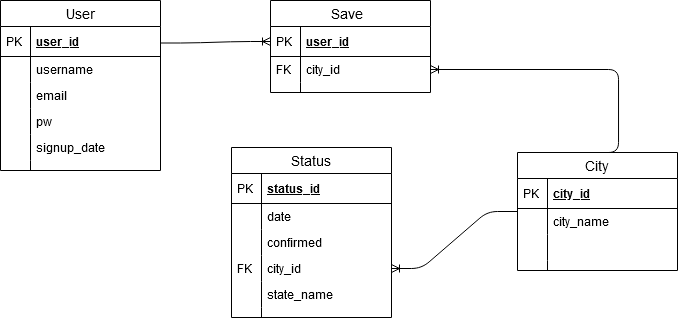

<h1 align="center">  𝘾𝙊𝙑𝙄𝘿⑲𝙎𝙏𝘼𝙏𝙐𝙎  </h1>
Covid19 Status is a Python/Flask app that allows users to search up confirmed cases of Covid19 in their county.
   
A graph made with D3 shows the stats for the past 10 days.

 
Features soon to be implemented include stats on fatalities and a tracker button that allows users to follow trends,
which will be displayed in the user dashboard.
 
 

<b><ins>BUILT WITH</ins></b>  

 

<b><ins>OTHER TECHNOLOGIES</ins></b>  
 SQLAlchemy & Jinja2  

<b><ins>API</ins></b>  
<a href="https://covid19api.com/#details">COVID-19 API</a>   

 

<b><ins>DATABASE TABLES</ins></b>  
User | Data Type | Keys 
:--: | :--: | :--: 
user_id | Integer | primary_key
username | String | - 
signup_date | Date | - 

 

City | Data Type | Keys 
:--: | :--: | :--: 
city_id | Integer | primary_key
city_name | String | -
state_name | String | -

 

Status | Data Type | Keys 
:--: | :--: | :--: 
status_id | Integer | primary_key
status_date | Date | - 
city_id | Integer | foreign_key
state_name| String | -
confirmed | Integer | - 

 

Save | Data Type | Keys
:--: | :--: |:--:
user_id | Integer | foreign_key
city_id | Integer | foreign_key

 <ins>Note</ins> : Save feature not yet implemented

 

<b><ins>DATA MODEL</ins></b>   

 

## INSTALLATION

#### Clone or fork this repo:

$ `git clone https://github.com/xerilius/covid19-status.git`

#### Create & Activate Virtual Environment
$ `virtualenv env`  
$ `source env/bin/activate`

#### Install dependencies
(env) $ `pip3 install -r requirements.txt`

#### Seed data into database
(env) $ `python3 seed.py`  
**Note:** Will take a while to insert all data into the database  
You can update the data daily by run uncommenting `run_task()` at the bottom of the file

#### Start Flask Server
(env) $ `export FLASK_APP=server.py`  
(env) $ `flask run --host=0.0.0.0`

#### Go to http://localhost:5000/ in your browser